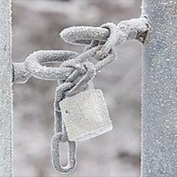

# why this fork

this fork was created to also kill a0 to stop system information
because... when you unban a switch you dont want to send over banned info while using donor info to authenticate :(

yes switch unbanning is possible and very easy to do, literally the last thing to do and the hardest is.. telemetry 

## Lock-Logs  (L-L)
* Stop sending telemetry to Nintendo
* Permanent modification of the save of [BCAT](https://switchbrew.org/wiki/BCAT_services)(Play Report)

0x80000000000000A0 (stop system information being sent over to avoid ban after unban)

0x80000000000000A1 (stop bannable telemetry)

0x80000000000000A2 (stop bannable telemetry)

[Source](https://switchbrew.org/wiki/Flash_Filesystem#System_Savegames)

* This stops sending telemetry to Nintendo

## Reason
* kill telemetry service to avoid get banned with cfw

## Disclaimer
* After a long time of testing, a console that did not send that telemetry is harder to ban than other consoles that did
* * Even so, the risk of ban exists so I recommend using emunand, if you don't want to take that risk
* This is a test, one thing is for sure, it stop the send telemetry through BCAT(PlayReport)
* It is not likely to happen but in case of instability in the system it can be uninstalled by Pressing + - inside the app or deleting from 'System:/save'
80000000000000A1 and 80000000000000A2 saves

### Note:
Tested on:
* 9.1.0 - 13.0.0
* * For use this mod you need update to the latest version required by Nintendo
* This modification will remain installed and will not be deleted until you decide to remove it
#### It will only be removed if:
- - Uninstall it from the app
- - Remove the saves 80000000000000A1 and 80000000000000A2
- - Restoring a nand backup
- - Using Haku33

### Credits
* devkitPro for the devkitA64 toolchain.

### Known Bugs
* None

